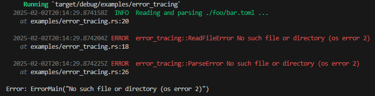

Error handling in Rust is deep.
The shallow part [enum Result<T, E>](https://doc.rust-lang.org/std/result/enum.Result.html) is part of the Rust language.
It is easy to understand and well designed.

Choosing an error handling concept for your project is the deep part. The amount of fashionable error handling crates does attest:
[error_set](https://docs.rs/error_set/latest/error_set), 
thiserror, 
anyhow, 
snafu, 
[eyre](https://github.com/eyre-rs/eyre), 
[error-stack](https://github.com/hashintel/hash/tree/main/libs/error-stack), ...

# Proposal

This repo proposes a dead simple solution such that

* The question mark operator [?](https://doc.rust-lang.org/reference/expressions/operator-expr.html#the-question-mark-operator) just works.
* Errors are part of the tracing and are never swallowed.
* For each method/function, declare up front which Errors are allowed to be propagated.
* Don't chain, log!
* Don't context, log!
* No need for `.context("")` or `map_err(|e| ...)` clutter.
* No need to collect a backtrace and fumble with `RUST(_LIB)_BACKTRACE` or `debug = true` in release mode
* No need to mess with `panic::set_hook` to [convert error post mortem output to structured log](https://stackoverflow.com/questions/78708247)
* Not a crate, no dependencies

The [example](examples/error_tracing.rs) will produce



# How does it work

Rust desugars the error propagation `?` operator, not considering [try-trait-v2](https://rust-lang.github.io/rfcs/3058-try-trait-v2.html),
like so:
```
fn foo() -> Result<(), E> {
    // expr? desugars to
    match expr {
        Ok(v) => v,
        Err(e) => return Err(E::from(e)),
    }
}
```

The only way to inject custom behaviour is therefore the `E::from` part.
We simply have to generate a `From` trait implementation for all allowed error propagations.
In the generated `From` impl, we use `#[track_caller]` to output [file, line and column](https://doc.rust-lang.org/std/panic/struct.Location.html).

# Kitchen Sink Resources

* [std::error::Error](https://doc.rust-lang.org/std/error/trait.Error.html) trait
* [oom with anyhow](https://www.qovery.com/blog/rust-investigating-a-strange-out-of-memory-error/)
* [Helper for passing extra context to Errors](https://internals.rust-lang.org/t/helper-for-passing-extra-context-to-errors/20259/10)

## Error Tree

* https://github.com/klebs6/klebs-general/tree/master/error-tree
* https://github.com/bobozaur/transitive
* https://github.com/steffahn/transitive_from
* https://internals.rust-lang.org/t/async-debugging-logical-stack-traces-setting-goals-collecting-examples/15547/2


